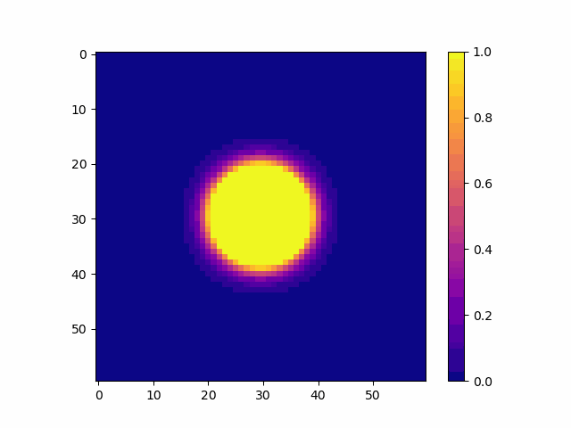
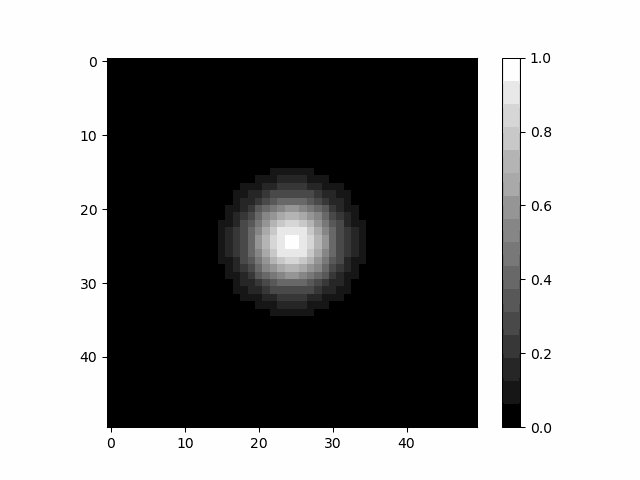

## Разработка и попытка некоторого подробного разбора метода Галеркина, Рица и некоторой части метода конечных элементов. 
В репозитории наибольший интерес представляют два класса решающих неоднородное уравнение теплопроводности с неоднородными коэффициентами и уравнение Шредингера, представленное решение выводится в виде анимации. Примеры использования в пунктах 3 и 4.  
1. Для полного понимания стоит начать с [простого примера](https://github.com/VladimirNikiforovv/Finite-element-method/blob/main/FEM_simple_case.ipynb "Решение краевой задачи") решения краевой задачи методом Рица.
2. Решение [уравнений в частных производных методом Галеркина – Кранка – Николсона](https://github.com/VladimirNikiforovv/Finite-element-method/blob/main/FEM_heat%20equation.ipynb " теплопроводность 1D"), для одномерного случая уравнения теплопроводности    с выводом схемы и демонстрацией решения сравнением численной схемы и аналитического решения. 
3. [Вывод схемы и пример использования](https://github.com/VladimirNikiforovv/Finite-element-method/blob/main/FEM_2D_Heat_Equation_nonhomogen_alpha.ipynb " теплопроводность 2D") написанного класса для решения неоднородного уравнение теплопроводности с неоднородными коэффициентами 2D, методом Галеркина – Кранка – Николсона.
4. [Вывод схемы и пример использования](https://github.com/VladimirNikiforovv/Finite-element-method/blob/main/FEM_2D_Schrodinger_Equation.ipynb " Шредингер 2D") написанного класса для решения уравнения Шредингера 2D, методом Галеркина – Кранка – Николсона.

п.с. буду рад любой конструктивной критике.

## Выводимые результаты  ##

Распространение тепла по некоторой области.

Движение волнового пакета.

## источники  ##

1. [ТЕОРИЯ МЕТОДА КОНЕЧНЫХ ЭЛЕМЕНТОВ] https://pnu.edu.ru/media/filer_public/2013/04/10/6-15_streng_1977.pdf),  Г.Стренг, Дж. Фикс., 1997
2. [ВВЕДЕНИЕ В МЕТОД КОНЕЧНЫХ ЭЛЕМЕНТОВ](http://elibrary.udsu.ru/xmlui/bitstream/handle/123456789/6649/2011272930.pdf?sequence=1), - Методическое пособие Ю. А. Сагдеева, С. П. Копысов, А. К. Новиков, 2011
3. [ВВЕДЕНИЕ В МЕТОД КОНЕЧНЫХ ЭЛЕМЕНТОВ] https://science.rau.am/uploads/documents/1670407600.pdf)  Ю.Р. Акопян, 2022
4. [ВВЕДЕНИЕ В МЕТОД КОНЕЧНЫХ ЭЛЕМЕНТОВ] https://science.rau.am/uploads/documents/1670407600.pdf)  А.В. СОЛДАТКИН, Е.С. БАРАНОВА 2020
